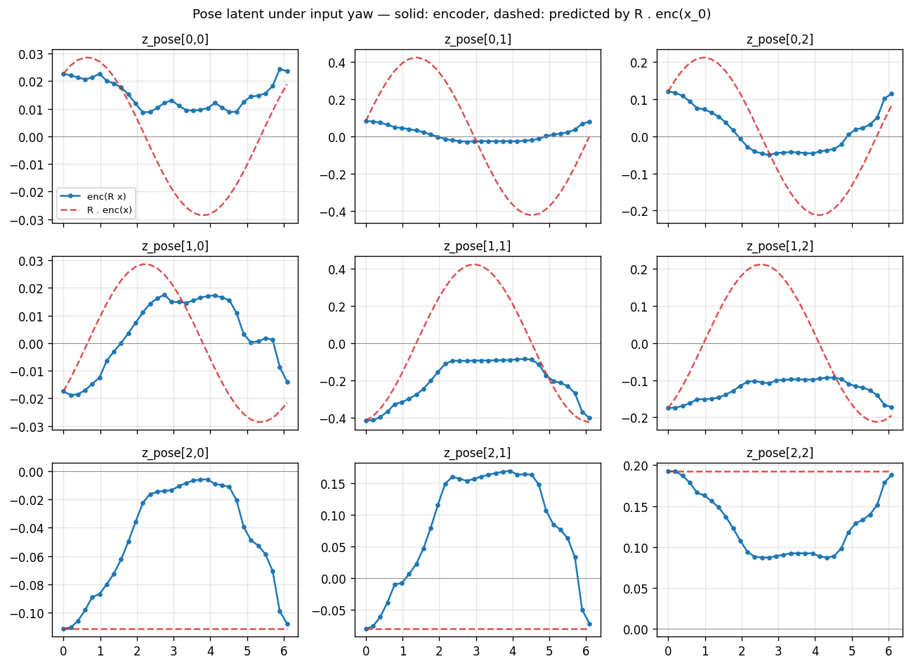
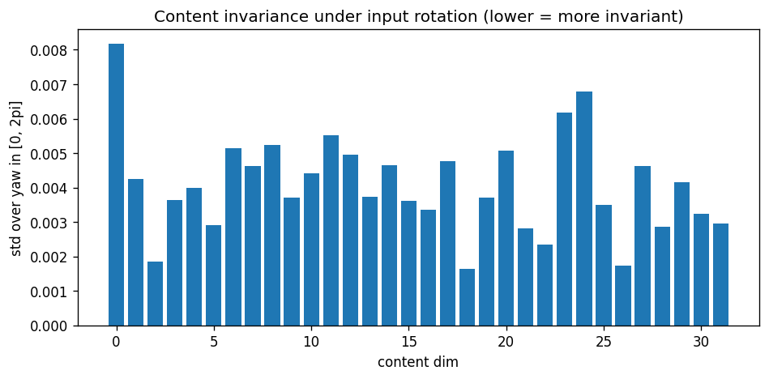

# Geometric learning — SO(3)-structured latent space for 3D point clouds

A small autoencoder whose latent space has explicit SO(3) structure: rotating a 3D object in input space corresponds to a known matrix multiply in latent space. Trained and evaluated on a Jetson Orin.

The Fourier-style mental model: a rotation in 3D space → a structured action on the latent code. Same idea as how a Fourier transform turns translation in image space into a phase shift in frequency space, but for SO(3) instead of translation.

## Setup

```bash
python -m pip install -r requirements.txt
# Download ModelNet10 (~450MB) into data_files/
mkdir -p data_files && cd data_files
curl -L -o modelnet10.zip http://3dshapenets.cs.princeton.edu/ModelNet10.zip
unzip -q modelnet10.zip && cd ..
```

## Run

```bash
python visualize_data.py    # writes assets/*.png (dataset + rotation visualizations)
python train.py             # trains, writes ckpts/model.pt
python eval.py              # writes ckpts/{pose_orbit_yaw,content_invariance,cycle_grid}.png
```

Default training is 2000 steps on 800 ModelNet10 meshes, batch 16, ~10 minutes on a Jetson Orin.

## Dataset

[ModelNet10](http://3dshapenets.cs.princeton.edu/) — 10 classes of CAD models (bathtub, bed, chair, desk, dresser, monitor, night_stand, sofa, table, toilet), ~4000 training meshes. We sample **1024 points uniformly on the surface** of each mesh via `trimesh.sample.sample_surface`, center the cloud, and rescale so the farthest point sits on the unit sphere. Rotations are exact `(3,3)` matrices applied to the point coordinates — no rasterization, no rendering, no angle discretization.

| One sample per class | Yaw rotation sweep |
| --- | --- |
|  |  |

| Random SO(3) rotations | Training pairs `(x, R·x)` |
| --- | --- |
|  |  |

## Architecture

Perceiver-style point cloud autoencoder, ~2.25M parameters.

- **Encoder** — embed each of `N=512` points (3 → 128) → cross-attend into `K=32` learned latent tokens → 4 self-attention layers on the latents → mean-pool → linear head producing `(z_content ∈ R³², z_pose ∈ R^{3×3})`.
- **Decoder** — project `(z_content, z_pose)` to 32 latent tokens (+ learned position embed) → 4 self-attention layers → 512 learned query tokens cross-attend into the latents → per-token linear → 3D coordinate. Output: `(B, 512, 3)`.
- **Group action** — the latent rotation is literally `R @ z_pose` (a 3×3 matmul). Each column of the pose matrix transforms as a 3D vector under SO(3).

## Training objective

```
L = chamfer(dec(z_c, z_p), x)
  + chamfer(dec(z_c_rot, z_p_rot), x_rot)
  + w_equiv · ‖z_p_rot − R·z_p‖²_F
  + w_inv   · ‖z_c_rot − z_c‖²
  + w_cycle · chamfer(dec(z_c, R·z_p), x_rot)
  + w_norm  · (‖z_p‖_F − √3)²
```

The **cycle term is load-bearing**: it forces the decoder to actually use `z_pose` as a rotation handle. Without it, the encoder can satisfy equivariance trivially (`z_p → 0`) and the decoder can ignore `z_pose` entirely. With it, the decoder must produce the correctly rotated output when the latent action is applied — that constraint is what makes `z_pose` carry real signal.

## Results

After 2000 steps on 800 meshes (10 min on Jetson Orin):

| Metric | Final value | Interpretation |
| --- | --- | --- |
| Reconstruction (chamfer) | 0.075 | Sum across `(x, x_rot)`; per-piece ≈ 0.038 |
| Equivariance loss | 0.030 | Mean squared element error on 3×3 pose matrix |
| Content invariance (std over yaw) | 0.004 | Content latent essentially constant under rotation |
| Cycle loss | 0.042 | Per-piece, matches reconstruction — the latent group action works |
| `‖z_pose‖_F` | 0.32 | Collapsed below target √3 ≈ 1.73 (see Limitations) |

### Pose orbit under input yaw

For each entry `[i,j]` of the predicted 3×3 pose matrix, we sweep the input yaw angle θ ∈ `[0, 2π]` and overlay (a) what the encoder produces from the rotated input, against (b) what the group action `R(θ)·z_p₀` predicts. They match in shape but at reduced amplitude — the encoder learned a scaled-down rotation matrix.



### Content invariance

Per-dimension standard deviation of `z_content` as the input rotates through `[0, 2π]`. Uniformly tiny — content is decoupled from rotation.



### Cycle reconstruction

Top: rotated input. Middle: full encode → decode (the network's own reconstruction). Bottom: `dec(z_content, R(θ)·z_pose)` — the *cycle*, where we encode the canonical input once, rotate the pose latent, and decode. The fact that the bottom row matches the middle row's quality is the actual demonstration that the latent group action is doing what it should.


## What works, what doesn't

**Works** — the structural goals.
- Content latent is essentially invariant to rotation.
- Pose latent transforms approximately equivariantly under `R`.
- Decoding from `R · z_pose` gives the same reconstruction quality as encoding the rotated input.

**Limitations** — the visual quality.
- The decoder collapses to a generic point distribution rather than the specific input shape. This is a known failure mode of Chamfer-only point cloud autoencoders (mean-shape collapse).
- Pose magnitude collapsed: `‖z_p‖_F ≈ 0.32` vs. target `√3`. The equivariance loss out-pulled the norm regularizer. Easy fix: bump `w_norm` from 0.05 → 1.0 next run.
- Mixed-class training (10 classes share one decoder) blurs the per-class shape detail. Single-class training (chairs only) would give a much cleaner visual demo with the same architecture.

The interesting result here is the structural one — that `R·z_p` works as the latent group action — not the reconstruction visual quality.

## Files

| File | Purpose |
| --- | --- |
| `data.py` | ModelNet10 loader, `rotation_matrix_yaw`, `random_rotation_matrix_so3`, `rotate_pointcloud`, `sample_pair_batch` |
| `model.py` | Perceiver encoder + decoder, `rotate_pose_matrix`, `chamfer_distance` |
| `train.py` | Training loop with the 6-term objective above |
| `eval.py` | Pose-orbit / content-invariance / cycle-reconstruction plots |
| `visualize_data.py` | Dataset + rotation visualizations |
| `assets/` | README dataset figures |
| `ckpts/` | Trained checkpoint + eval figures |

## References

- **Quessard et al. 2020**, [*Learning Disentangled Representations and Group Structure of Dynamical Environments*](https://arxiv.org/abs/2002.06991) — closest prior work on group-structured latent spaces.
- **Cohen & Welling 2016**, *Group Equivariant Convolutional Networks* — foundational paper for equivariant deep nets.
- **Deng et al. 2021**, *Vector Neurons* — practical SO(3)-equivariant point cloud features (alternative to the soft-equivariance approach used here).
- **Jaegle et al. 2021**, *Perceiver* — the encoder/decoder pattern (cross-attend points → self-attend latents → cross-attend queries).
