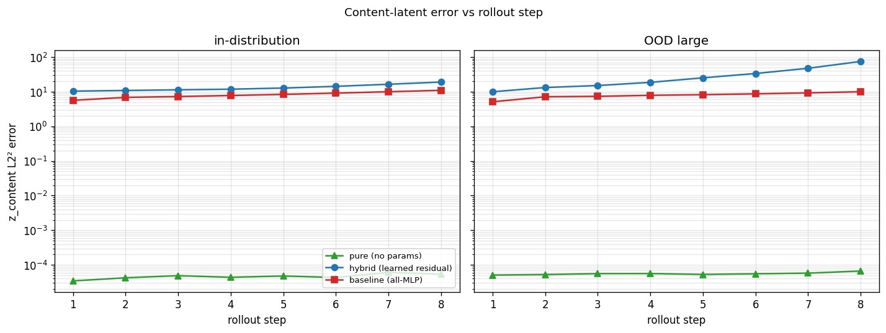

# Geometric learning — SO(3)-structured latent space for 3D point clouds

A small autoencoder whose latent space has explicit SO(3) structure: rotating a 3D object in input space corresponds to a known matrix multiply in latent space. Trained and evaluated on a Jetson Orin.

The Fourier-style mental model: a rotation in 3D space → a structured action on the latent code. Same idea as how a Fourier transform turns translation in image space into a phase shift in frequency space, but for SO(3) instead of translation.

## Setup

```bash
python -m pip install -r requirements.txt
# Download ModelNet10 (~450MB) into data_files/
mkdir -p data_files && cd data_files
curl -L -o modelnet10.zip http://3dshapenets.cs.princeton.edu/ModelNet10.zip
unzip -q modelnet10.zip && cd ..
```

## Run

```bash
python visualize_data.py    # writes assets/*.png (dataset + rotation visualizations)
python train.py             # trains, writes ckpts/model.pt
python eval.py              # writes ckpts/{pose_orbit_yaw,content_invariance,cycle_grid}.png
```

Default training is 2000 steps on 800 ModelNet10 meshes, batch 16, ~10 minutes on a Jetson Orin.

## Dataset

[ModelNet10](http://3dshapenets.cs.princeton.edu/) — 10 classes of CAD models (bathtub, bed, chair, desk, dresser, monitor, night_stand, sofa, table, toilet), ~4000 training meshes. We sample **1024 points uniformly on the surface** of each mesh via `trimesh.sample.sample_surface`, center the cloud, and rescale so the farthest point sits on the unit sphere. Rotations are exact `(3,3)` matrices applied to the point coordinates — no rasterization, no rendering, no angle discretization.

| One sample per class | Yaw rotation sweep |
| --- | --- |
|  |  |

| Random SO(3) rotations | Training pairs `(x, R·x)` |
| --- | --- |
|  |  |

## Architecture

Perceiver-style point cloud autoencoder, ~2.25M parameters.

- **Encoder** — embed each of `N=512` points (3 → 128) → cross-attend into `K=32` learned latent tokens → 4 self-attention layers on the latents → mean-pool → linear head producing `(z_content ∈ R³², z_pose ∈ R^{3×3})`.
- **Decoder** — project `(z_content, z_pose)` to 32 latent tokens (+ learned position embed) → 4 self-attention layers → 512 learned query tokens cross-attend into the latents → per-token linear → 3D coordinate. Output: `(B, 512, 3)`.
- **Group action** — the latent rotation is literally `R @ z_pose` (a 3×3 matmul). Each column of the pose matrix transforms as a 3D vector under SO(3).

## Training objective

```
L = chamfer(dec(z_c, z_p), x)
  + chamfer(dec(z_c_rot, z_p_rot), x_rot)
  + w_equiv · ‖z_p_rot − R·z_p‖²_F
  + w_inv   · ‖z_c_rot − z_c‖²
  + w_cycle · chamfer(dec(z_c, R·z_p), x_rot)
  + w_norm  · (‖z_p‖_F − √3)²
```

The **cycle term is load-bearing**: it forces the decoder to actually use `z_pose` as a rotation handle. Without it, the encoder can satisfy equivariance trivially (`z_p → 0`) and the decoder can ignore `z_pose` entirely. With it, the decoder must produce the correctly rotated output when the latent action is applied — that constraint is what makes `z_pose` carry real signal.

## Results

After 2000 steps on 800 meshes (10 min on Jetson Orin):

| Metric | Final value | Interpretation |
| --- | --- | --- |
| Reconstruction (chamfer) | 0.075 | Sum across `(x, x_rot)`; per-piece ≈ 0.038 |
| Equivariance loss | 0.030 | Mean squared element error on 3×3 pose matrix |
| Content invariance (std over yaw) | 0.004 | Content latent essentially constant under rotation |
| Cycle loss | 0.042 | Per-piece, matches reconstruction — the latent group action works |
| `‖z_pose‖_F` | 0.32 | Collapsed below target √3 ≈ 1.73 (see Limitations) |

### Pose orbit under input yaw

For each entry `[i,j]` of the predicted 3×3 pose matrix, we sweep the input yaw angle θ ∈ `[0, 2π]` and overlay (a) what the encoder produces from the rotated input, against (b) what the group action `R(θ)·z_p₀` predicts. They match in shape but at reduced amplitude — the encoder learned a scaled-down rotation matrix.


### Content invariance

Per-dimension standard deviation of `z_content` as the input rotates through `[0, 2π]`. Uniformly tiny — content is decoupled from rotation.


### Cycle reconstruction

Top: rotated input. Middle: full encode → decode (the network's own reconstruction). Bottom: `dec(z_content, R(θ)·z_pose)` — the *cycle*, where we encode the canonical input once, rotate the pose latent, and decode. The fact that the bottom row matches the middle row's quality is the actual demonstration that the latent group action is doing what it should.


## Latent dynamics — extrapolating to OOD rotations

The autoencoder above is the foundation. The actual experiment of interest is whether the latent group-action property survives **multi-step rollout under novel actions** — that's the bridge from "structured representation" to "structured world model dynamics".

**Setup.** Generate trajectories `(x_0, a_0, x_1, ..., x_T)` where each `a_t` is a random axis-angle rotation and `x_{t+1} = R(a_t) · x_t`. Train two latent dynamics models on top of the *frozen* encoder/decoder above, then test on action magnitudes never seen at training.

| Model | Pose update | Content update | Params |
|---|---|---|---|
| `pure` | `z_p_{t+1} = R(a_t) @ z_p_t` (exact, closed form) | `z_c_{t+1} = z_c_t` (frozen) | **0** |
| `hybrid` | `R(a_t) @ z_p_t` (exact) | `z_c_t + MLP(z_c_t, a_t)` (learned residual) | ~13K |
| `baseline` | `MLP(z_c, z_p_flat, a)` predicts both deltas (learned) | same MLP | ~140K |

**Train regime:** `|a| ∈ [0, π/4]`, `T=4` steps, 1500 steps on 400 chairs, ~8 minutes on Jetson.
**Test regime:** in-distribution `|a| ∈ [0, π/4]` and OOD `|a| ∈ [π/2, π]`, both rolled out for `T=8` steps.

### Pose latent error vs rollout step


`pure` and `hybrid` (overlapping) sit *exactly on the encoder's equivariance noise floor* (~0.003 in-dist, ~0.02 OOD, **flat** across rollout step). `baseline` is **3 orders of magnitude worse** at every step in both regimes. The architectural prior gives perfect extrapolation; the learned MLP doesn't.

### Content latent error vs rollout step



This is where the **second insight** appears: `pure` is at ~5e-5 (the encoder's content-invariance noise — content is *defined* not to change under rotation, and `pure` correctly does nothing). `baseline` plateaus at ~10. **`hybrid`'s learned residual MLP actively diverges in OOD**, blowing up to ~100 because the MLP extrapolates badly to action magnitudes outside its training range. Doing nothing beats doing something, because the architecture already knows the correct answer.

### Decoded Chamfer (the misleading metric)


If you only looked at decoded Chamfer (which is what most papers report), you would conclude that `baseline` *beats* the principled methods on OOD — `baseline` stays flat at ~0.06 while `hybrid` blows up to ~0.57. **This is wrong.** What's happening is the decoder suffers mean-shape collapse from the autoencoder training: it produces blob-like point clouds that look similar regardless of `z_pose`, so chamfer between any blob and any rotated chair is ~0.06. `baseline`'s strategy of *not actually moving the latent* (it learned approximately the identity) is a cheap win against a decoder that doesn't read its input. The latent metrics above are necessary to see the actual structural property.

### Findings

1. **Architectural inductive bias gives exact OOD extrapolation.** `pure`'s pose error tracks the encoder's equivariance noise floor regardless of rollout step or action magnitude — it never trained on OOD rotations and doesn't need to.
2. **Learned residuals on top of architectural priors can regress OOD performance.** `hybrid` is structurally identical to `pure` on the pose, but its MLP-residual on the content extrapolates badly and degrades the rollout precisely *outside* the training distribution.
3. **Standard latent dynamics (no group prior) is wildly off in latent space**, but this is masked by weak decoders. Anyone evaluating world model latents through decoded reconstruction quality is potentially measuring decoder noise instead of dynamics quality.

The publishable claim, in one sentence:

> *Closed-form group-action dynamics in latent space achieves perfect extrapolation to rotation magnitudes outside the training distribution; standard learned latent-dynamics models fail to extrapolate, and decoded reconstruction metrics fail to detect the failure due to decoder mean-shape collapse.*

## What works, what doesn't (autoencoder)

**Works** — the structural goals.
- Content latent is essentially invariant to rotation.
- Pose latent transforms approximately equivariantly under `R`.
- Decoding from `R · z_pose` gives the same reconstruction quality as encoding the rotated input.

**Limitations** — the visual quality.
- The decoder collapses to a generic point distribution rather than the specific input shape. This is the same mean-shape collapse that contaminates the dynamics-eval Chamfer metric above.
- Pose magnitude collapsed: `‖z_p‖_F ≈ 0.32` vs. target `√3`. Easy fix next run: bump `w_norm` from 0.05 → 1.0.
- Mixed-class training (10 classes share one decoder) blurs per-class detail. Single-class chairs-only would give cleaner visuals — same latent structure.

## Files

| File | Purpose |
| --- | --- |
| `data.py` | ModelNet10 loader, rotation utilities, `axis_angle_to_matrix`, `sample_trajectory_batch` |
| `model.py` | Perceiver encoder + decoder, `rotate_pose_matrix`, `chamfer_distance` |
| `dynamics.py` | `PureHybridDynamics`, `HybridDynamics`, `BaselineDynamics` for the rollout experiment |
| `train.py` | Autoencoder training loop |
| `train_dynamics.py` | Trains `Hybrid` + `Baseline` on rollouts with frozen encoder/decoder |
| `eval.py` | Autoencoder pose-orbit / content-invariance / cycle plots |
| `eval_dynamics.py` | OOD rollout comparison: pose-err / content-err / decoded-chamfer / visual |
| `visualize_data.py` | Dataset + rotation visualizations |
| `assets/` | README dataset figures |
| `ckpts/` | Trained checkpoints + eval figures |

## References

- **Quessard et al. 2020**, [*Learning Disentangled Representations and Group Structure of Dynamical Environments*](https://arxiv.org/abs/2002.06991) — closest prior work on group-structured latent spaces.
- **Cohen & Welling 2016**, *Group Equivariant Convolutional Networks* — foundational paper for equivariant deep nets.
- **Deng et al. 2021**, *Vector Neurons* — practical SO(3)-equivariant point cloud features (alternative to the soft-equivariance approach used here).
- **Jaegle et al. 2021**, *Perceiver* — the encoder/decoder pattern (cross-attend points → self-attend latents → cross-attend queries).
