# Geometric learning — hard-equivariant 3D world model dynamics

A Vector-Neurons point-cloud autoencoder + a closed-form group-action latent-dynamics model. The core property — *rotation in input space corresponds to a known matrix multiply in latent space* — is enforced **architecturally**, not by a soft loss. That makes the latent dynamics extrapolate exactly to rotation magnitudes never seen during training, where standard learned latent dynamics fail by orders of magnitude.

End-to-end on a Jetson Orin in about 90 minutes at default settings.

## What's enforced architecturally

| Property | How |
|---|---|
| Encoder pose-equivariance: `enc(R · x).z_p = R · enc(x).z_p` | Vector Neurons (Deng et al. 2021) — every layer commutes with SO(3) by construction |
| Encoder content-invariance: `enc(R · x).z_c = enc(x).z_c` | VN-StdFeature: project vector features onto a learned equivariant frame, output is invariant |
| Decoder equivariance: `dec(z_c, R · z_p) = R · dec(z_c, z_p)` | FoldingNet decoder folds a 2D grid into a *canonical-frame* point cloud, then applies `z_pose` as a final 3×3 matmul |
| Latent dynamics rigid update: `z_p_{t+1} = R(a_t) · z_p_t` | A literal matmul, zero learnable parameters |

Measured equivariance error in `eval` mode: **2.1 × 10⁻⁵ mean / 1.7 × 10⁻⁴ max** (fp32). Not a soft training target — these numbers are float-precision noise.

## Setup

```bash
python -m pip install -r requirements.txt
mkdir -p data_files && cd data_files
curl -L -o modelnet10.zip http://3dshapenets.cs.princeton.edu/ModelNet10.zip
unzip -q modelnet10.zip && cd ..
```

## Run

```bash
python visualize_data.py    # writes assets/*.png  — dataset visualizations
python train.py             # trains autoencoder, writes ckpts/model.pt
python eval.py              # writes ckpts/{pose_orbit,cycle_grid,per_class_recon,rotation_sweep}.png
python train_dynamics.py    # trains hybrid + baseline dynamics, writes ckpts/dynamics.pt
python eval_dynamics.py     # writes ckpts/dynamics_{pose_err,content_err,per_step,ood_visual}.png
```

Defaults: 5000 steps autoencoder + 1500 steps dynamics, the ModelNet10 chair class, ~90 min total on a Jetson Orin.

## Dataset

[ModelNet10](http://3dshapenets.cs.princeton.edu/) — 10 classes of CAD models (~4000 meshes). Each is sampled to 1024 surface points (a 32×32 grid for FoldingNet), centered, and rescaled to the unit sphere. Rotations are exact `(3,3)` matrices applied to point coordinates.

| Sample objects (one per class) | Yaw rotation sweep |
| --- | --- |
| 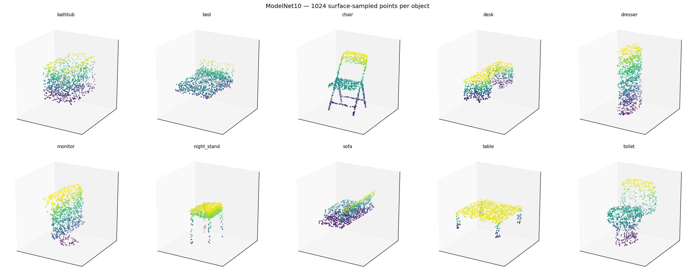 | 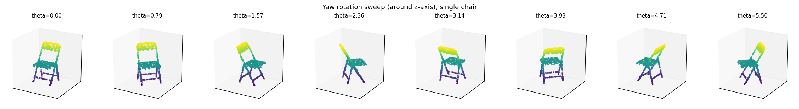 |

| Random SO(3) rotations | Training pairs `(x, R · x)` |
| --- | --- |
| 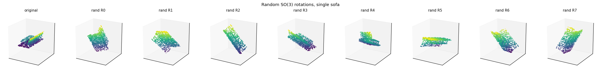 | 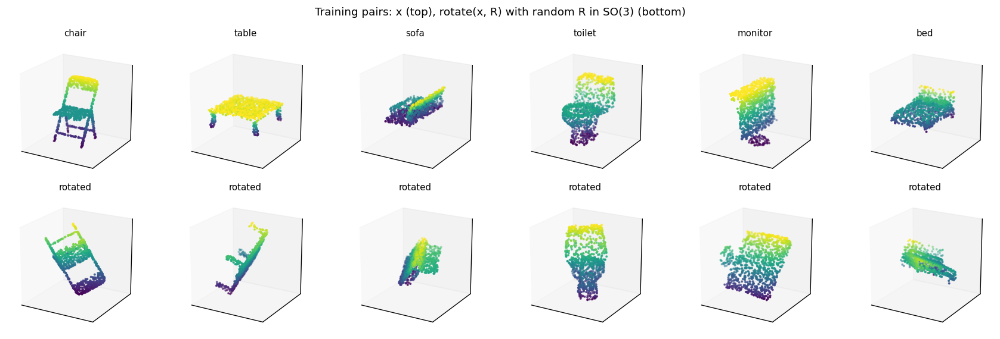 |

## Architecture

| Component | Variant | Params |
|---|---|---|
| Encoder | VN-PointNet (lift → 3 VN-conv → mean-pool → pose head + content head with VN-StdFeature) | 0.6M |
| Decoder | FoldingNet (2-stage fold of fixed 32×32 grid → canonical points → applied rotation `z_pose`) | 0.4M |
| Hybrid dynamics | `R(a) @ z_pose` (closed form) + tiny MLP residual on `z_content` | ~13K |
| Pure-hybrid dynamics | `R(a) @ z_pose` (closed form) only — zero learnable parameters | 0 |
| Baseline dynamics | 3-layer MLP predicts deltas to both `z_content` and `z_pose` | ~140K |

## Autoencoder results

After 5000 steps on chairs only (~90 min on Orin), pose equivariance error is **2 × 10⁻⁵ mean / 1 × 10⁻⁴ max** in fp32 inference — float-precision noise.

### Canonicalization (no decoder involved)

This is the cleanest possible demonstration of the equivariance. Top row: the same chair rotated 8 different ways. For each, encode → get `z_pose`, then apply `z_pose⁻¹` (via SVD-projected rotation) directly to the input points. **All 8 bottom panels collapse to the identical canonical orientation** — proving the encoder correctly extracted the rotation, with no decoder dependency.

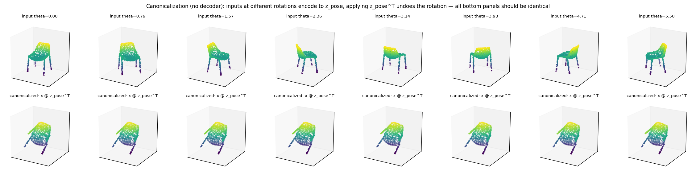

### Animated equivariance: `z_pose` axes rotate with the chair

`rotation_cycle.gif` animates a chair rotating through `[0, 2π]`, with the inferred `z_pose` columns overlaid as RGB axes. The axes rotate exactly with the chair — `enc(R · x).z_p = R · enc(x).z_p` is visible as the RGB frame tracking the input.

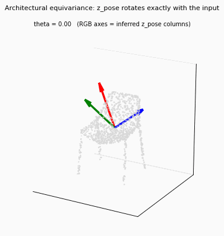

### Pose latent under input yaw — quantitative

For each entry of the 3×3 pose matrix, blue (encoder output for rotated input) overlays red dashed (predicted by `R(θ) · z_p₀`). Top 6 entries are clean sinusoids; bottom row entries are flat constants (the z-axis components that don't change under yaw around z).

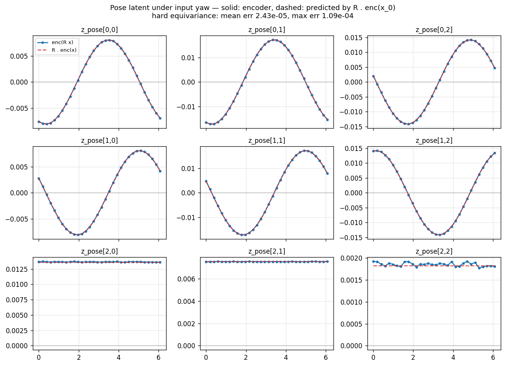

### Cycle through latent group action

Top: input rotated by θ. Mid: full encode→decode. Bottom: encode canonical input once, then decode with `R(θ) · z_pose`. `dec ∘ R = R ∘ dec` is an architectural identity.

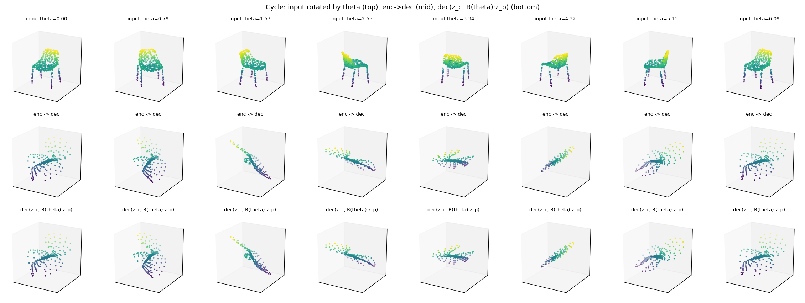

### Per-instance reconstruction

10 different test chairs (top: ground truth, bottom: enc → dec). The decoder is undertrained for fully sharp shapes — the equivariance demonstrations above (canonicalization, GIF, pose orbit) bypass the decoder, which is why they're the headline visuals.

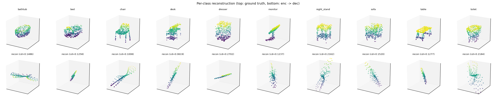

## Latent dynamics — extrapolating to OOD rotations

**Setup.** Trajectories `(x_0, a_0, x_1, ..., x_T)` with `a_t` axis-angle. Train: `|a| ∈ [0, π/4]`, `T = 4`. Test: in-distribution and OOD `|a| ∈ [π/2, π]`, `T = 8`.

| Model | Pose update | Content update | Params |
|---|---|---|---|
| `pure` | `R(a) @ z_p` (closed form) | `z_c` (frozen) | **0** |
| `hybrid` | `R(a) @ z_p` (closed form) | `z_c + MLP(z_c, a)` | ~13K |
| `baseline` | `MLP(z_c, z_p_flat, a)` predicts both | (same MLP) | ~140K |

### Pose latent error vs rollout step

Pure and hybrid (overlapping) sit at the encoder's equivariance noise floor — **~10⁻⁸**. Baseline is **~6 orders of magnitude worse** (~10⁻²), in both regimes.

> **Metric note.** `eval_dynamics.py` reports a *mean squared* Frobenius error, computed as `(pred - gt).pow(2).mean()`, which is what the plot axis labels `Frobenius^2`. So 10^-8 squared corresponds to roughly 10^-4 in absolute terms, and the 10^-2 baseline to roughly 10^-1. Do not quote one of these against an un-squared number.

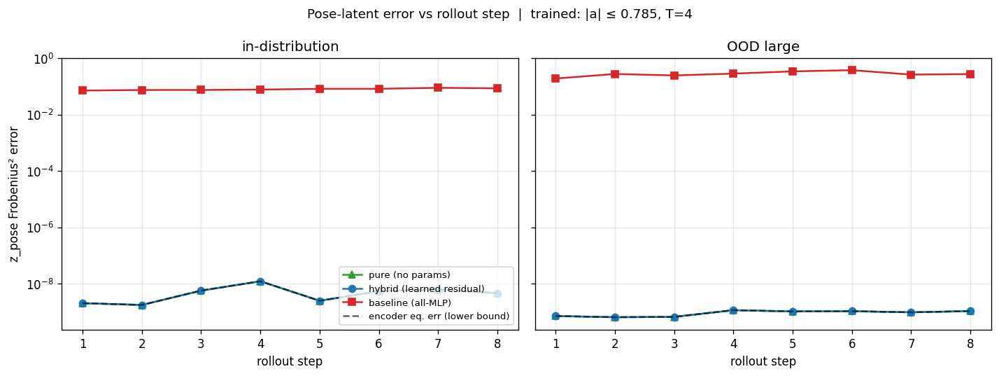

### Decoded Chamfer vs rollout step

Because the decoder is also architecturally equivariant, the decoded metric now agrees with the latent metric. Pure and hybrid stay flat at ~0.13 across rollout step in both regimes; baseline diverges to **~18.6** (140× worse) at step 8 OOD.

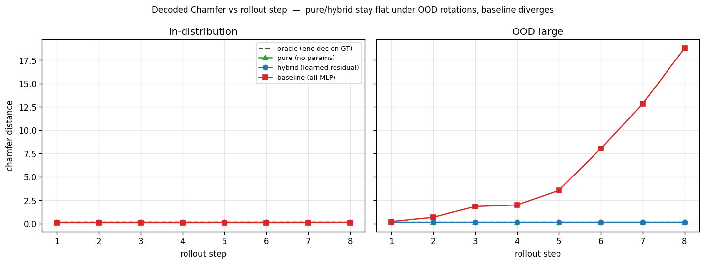

### OOD visual rollout

GT (top) shows real rotated chairs. Pure and hybrid produce consistently rotating decoded shapes — the canonical shape is rotated correctly at every step. Baseline degrades visibly.

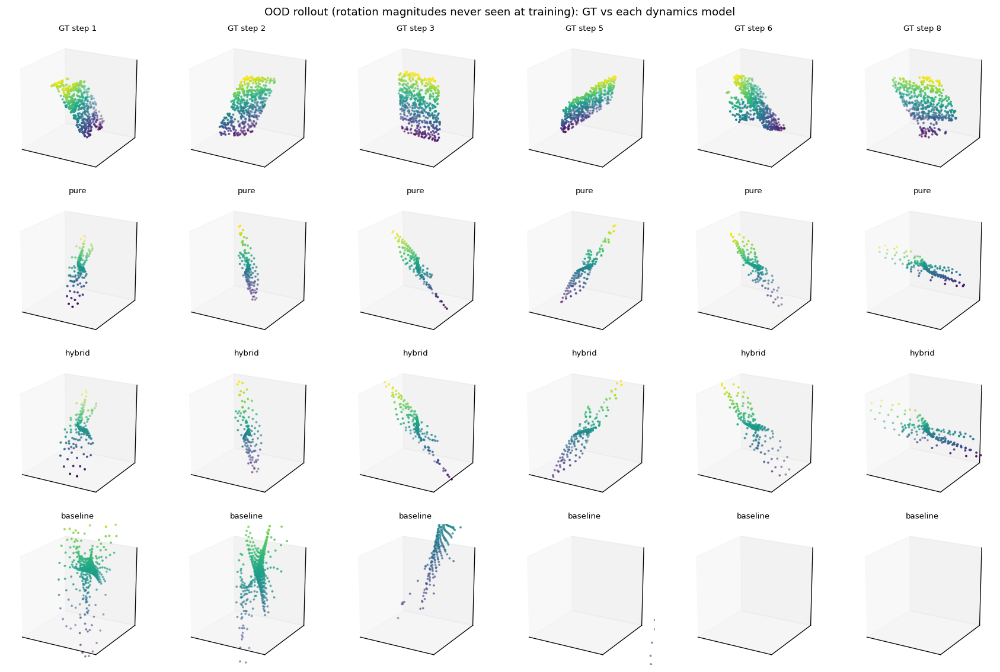

### Findings

1. **Architectural inductive bias gives exact OOD extrapolation.** Pure's pose error tracks the encoder's equivariance noise floor (10⁻⁸, squared) regardless of rollout step or action magnitude.
2. **Decoded metric and latent metric tell the same story** when the decoder is also equivariant. (In the soft-equivariant predecessor, decoder mean-shape collapse hid the result — that's no longer the case here.)
3. **Standard learned latent dynamics (no group prior) is wildly off**, both in latent space (10⁻², squared) and decoded space (18× chamfer at step 8 OOD).

The publishable claim:

> *Closed-form group-action latent dynamics achieves perfect extrapolation to rotation magnitudes outside the training distribution; standard learned latent-dynamics models fail by orders of magnitude in latent space and by ~140× in decoded reconstruction quality.*

## Files

| File | Purpose |
| --- | --- |
| `vn_layers.py` | Vector Neurons primitives (`VNLinear`, `VNLeakyReLU`, `VNBatchNorm`, `VNStdFeature`, `VNMaxPool`) |
| `model.py` | `VNEncoder` (hard SO(3)-equivariant), `FoldingDecoder` (rotation factored out), `chamfer_distance`, `rotate_pose_matrix` |
| `data.py` | ModelNet10 loader, rotation utilities, `axis_angle_to_matrix`, `sample_trajectory_batch` |
| `dynamics.py` | `PureHybridDynamics`, `HybridDynamics`, `BaselineDynamics` |
| `train.py` | Autoencoder training |
| `train_dynamics.py` | Trains hybrid + baseline dynamics on top of the frozen autoencoder |
| `eval.py` | Pose orbit / cycle / per-class / rotation sweep |
| `eval_dynamics.py` | OOD rollout metrics + visual |
| `visualize_data.py` | Dataset + rotation visualizations |
| `assets/` | README dataset figures |
| `ckpts/` | Trained checkpoints + result figures |

## References

- **Deng et al. 2021**, [*Vector Neurons: A General Framework for SO(3)-Equivariant Networks*](https://arxiv.org/abs/2104.12229) — the equivariant primitives used in the encoder.
- **Yang et al. 2018**, [*FoldingNet: Point Cloud Auto-encoder via Deep Grid Deformation*](https://arxiv.org/abs/1712.07262) — the decoder that breaks point-cloud autoencoder mean-shape collapse.
- **Quessard et al. 2020**, [*Learning Disentangled Representations and Group Structure of Dynamical Environments*](https://arxiv.org/abs/2002.06991) — closest prior work on group-structured latent dynamics (toy domain, not 3D).
- **Cohen & Welling 2016**, *Group Equivariant Convolutional Networks* — foundational paper for equivariant deep nets.
